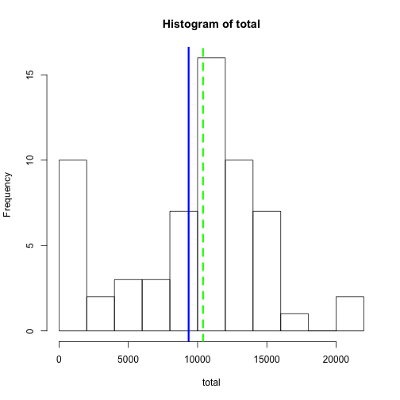
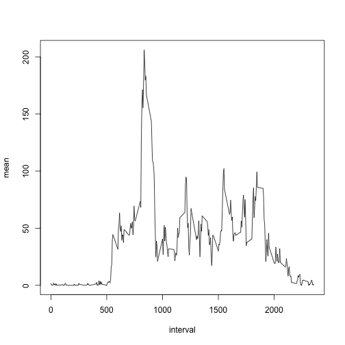
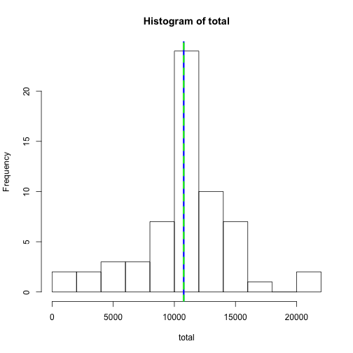
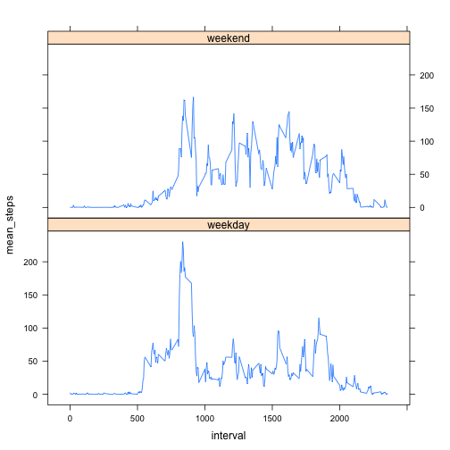

This report presents an analysis of an activity monitoring dataset as required for the Reproducible Data Coursera coure's first project. The results of the analysis are presented in the this document.

## Loading and preprocessing the data

In our analysis we'll be using the provided activity monitoring dataset.

```r
if( ! file.exists('activity.csv') ) {
  unzip('activity.zip')
}
dat <- read.csv('activity.csv')
dat$date <- as.POSIXct(dat$date)
```
Using this data, we can address each of the posed questions.

## What is the mean total number of steps taken per day?

To answer this question, first we need to sum the number of steps taken over the dates in the data.
We can then calculate the median and mean of the number of total steps per day.


```r
total_step_analysis <- function(data) {
  results = list()
  ttl <- tapply(data$steps, data$date, sum, na.rm=TRUE)
  results$by_date <- data.frame( date=names(ttl), total = ttl )
  results$daily_ttl_mean = with(results$by_date, mean(total, na.rm=TRUE))
  results$daily_ttl_median = with(results$by_date, median(total, na.rm=TRUE))
  results
}
by_date_orig <- total_step_analysis(dat)
```

The histogram below shows the variation of total steps taken per day. The mean value is show in blue and the median value is shown in green.


```r
total_step_hist <- function(ttl_step) {
  with(ttl_step$by_date, hist(total, 15))
  abline(v=ttl_step$daily_ttl_mean,col='blue',lwd=3)
  abline(v=ttl_step$daily_ttl_median,col='green',lwd=3, lty=2)
}
total_step_hist(by_date_orig)
```

 

Over all the observed days, the mean total number of steps per day was 9354.2295082 and the median was 10395.

## What is the average daily activity pattern?

To get started on this analysis, first we'll need to average the steps taken over all the observed days while keeping the interval (or time of day) fixed.


```r
mn_interval <- tapply(dat$steps, dat$interval, mean, na.rm = TRUE)
by_interval <- data.frame( interval=as.numeric(names(mn_interval)) , mean = mn_interval)
```

Using this dataset, we can generate an "average" time series plot showing the relationship between steps taken and time of day.


```r
with(by_interval, plot(interval, mean, type='l'))
```

 

From the plot, it looks like the maximum number of steps are taken somewhere in the range of 800 or 900. Using the data, we can find that maximum exactly:


```r
by_interval[by_interval$mean==max(by_interval$mean),]
```

```
##     interval     mean
## 835      835 206.1698
```

## Inputing missing values

A simple summary of the data shows that there are fair number of missing values coded as NAs.


```r
s <- summary(dat$steps)
print(s)
```

```
##    Min. 1st Qu.  Median    Mean 3rd Qu.    Max.    NA's 
##    0.00    0.00    0.00   37.38   12.00  806.00    2304
```

```r
na_cnt <- s[["NA's"]]
```

Specifically, there are 2304 missing data for the number of steps taken.

We will fill in the missing data using the mean value (across non-missing data) for the given time of day. We'll also double check that doing so results in no missing data for the number of steps taken.

```r
lookup_missing <- function(i) {
  r_idx <- which(by_interval$interval==i)
  val <- ifelse(length(r_idx)==1,by_interval[r_idx,'mean'],NA)
  val
}

dat_fixed <- dat
m_idx <- is.na(dat_fixed$steps)
dat_fixed[m_idx,'steps'] <- sapply(dat_fixed[m_idx,'interval'],lookup_missing)
# Double check to make sure all the missing steps are gone.
length(which(is.na(dat_fixed$steps)))
```

```
## [1] 0
```

Using this augmented dataset, we can show the histogram of the total number of steps.

```r
by_date_fixed <- total_step_analysis(dat_fixed)
total_step_hist(by_date_fixed)
```

 

Using the augmented data, the median number of steps taken per day is 1.0766189 &times; 10<sup>4</sup> and the mean value is 1.0766189 &times; 10<sup>4</sup>. By filling in the missing values, the data have become strongly unimodal around the mean values, enough to bring the mean and median to almost the same value, which is in the neighborhood of the median value from the original data.

## Are there differences in activity patterns between weekdays and weekends?

Using the augmented data, we explore the mean number of steps taken over the day conditioned on whether the day is a weekday or a weekend. 


```r
library(reshape2)
library(lattice)
dat_fixed$weekend <- as.factor(ifelse(weekdays(dat_fixed$date) %in% c('Saturday','Sunday'),
                                      'weekend','weekday'))
y <- tapply(dat_fixed$steps, list(dat_fixed$interval,dat_fixed$weekend), mean)
y <- melt(y,varnames=c('interval','weekend'),value.name='mean_steps')
xyplot(mean_steps ~ interval | weekend, data=y, layout=c(1,2), type='l')
```

 

There does appear to be a difference between the steps taken over the course of a weekday versus a weekend day, particularly in the morning.
